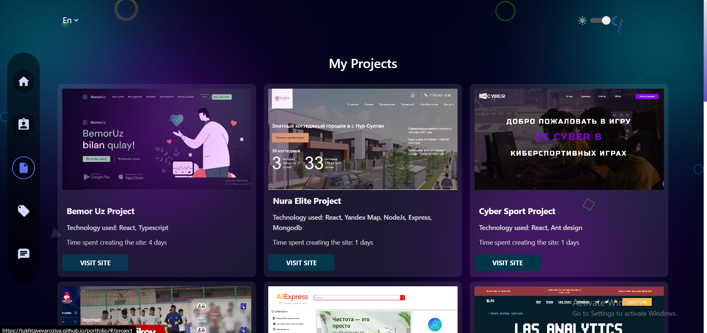

## Preview

## 💼 Personal Portfolio Website

A modern and responsive developer portfolio built to showcase my projects, skills, and experience. The website provides recruiters and collaborators with a quick overview of my technical abilities and work.

### 🚀 Tech Stack
- React
- TypeScript
- i18next
- MUI

### ✨ Features
- Clean and responsive UI
- Project showcase section
- Skills and experience overview
- Contact section for collaboration

### 🎯 Purpose
This project was created to present my work in a professional way and make it easier for recruiters and teams to explore my projects and technical skills.

### 🔗 Live Demo
Check out the live portfolio: [My Portfolio](https://tukhtayevaroziya.github.io/portfolio/#/)
