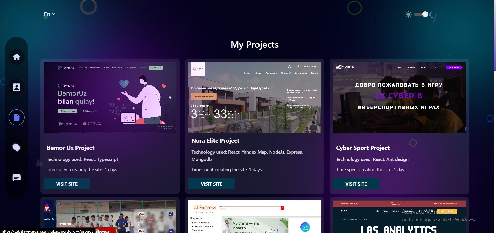

## Preview

## 💼 Personal Portfolio Website

A modern and responsive developer portfolio built to showcase my projects, skills, and experience. The website provides recruiters and collaborators with a quick overview of my technical abilities and work.

### 🚀 Tech Stack
- React
- TypeScript
- i18next
- MUI
-- QA
- Playwright
- Jira
- Google sheet

### ✨ Features
- Clean and responsive UI
- Project showcase section
- Skills and experience overview
- Contact section for collaboration

## 🧪 QA Documentation & Bug Tracking
* 📋 **QA Checklist:** [Portfolio QA Checklist (Google Sheets)](https://docs.google.com/spreadsheets/d/1BBLdAQH47GQW4ioG4HWll1W8yvXwaQECnjCpkTDYhvA/edit?usp=sharing)
* 🐞 **Jira Board:** [Bug Tracking Board](https://roziyasworkspace-43192583.atlassian.net/jira/software/projects/KAN/boards/1?filter=&groupBy=none&atlOrigin=eyJpIjoiNmE4NzgyZmFlY2Y4NDYxYmExZmUyNjVmOGQzMzk0MDciLCJwIjoiaiJ9)

### 🎯 Purpose
This project was created to present my work in a professional way and make it easier for recruiters and teams to explore my projects and technical skills.

### 🔗 Live Demo
Check out the live portfolio: [My Portfolio](https://tukhtayevaroziya.github.io/portfolio/#/)
